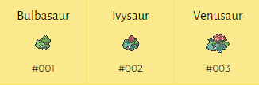
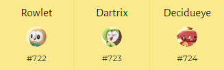

# Living Dex Pokésprite Spritesheet
For my Living Dex Project, I need Pokémon sprites for my huge list of caught Pokémon in [Making a Living Dex: Appendix A - The Whole Living Dex Roster](https://www.nikouusitalo.com/blog/making-a-living-dex-appendix-a-the-whole-living-dex-roster/). The spites come from [Pokesprite](https://github.com/msikma/pokesprite), which I think is what everyone who needs sprites uses. The spritesheet I originally used was based off the work from [PokdexTracker](https://pokedextracker.com/) which had their own generator as [pokesprite-fork](https://github.com/pokedextracker/pokesprite-fork) which is a fork of the original [Pokesprite](https://github.com/msikma/pokesprite). 

However I didn't like the direction PokedexTracker went with Pokemon Legends Arceus where they used the more rounded and 3D look that the game did for sprite portraits. And with that, this project was created so I could easily generate my own spritesheets exactly to my needs. 

| Pixel-based                                    | 3D-based                                    |
| ---------------------------------------------- | ------------------------------------------- |
|  |  |
|                                                |                                             |

This work is be heavily influenced by the PokdexTracker fork. 

